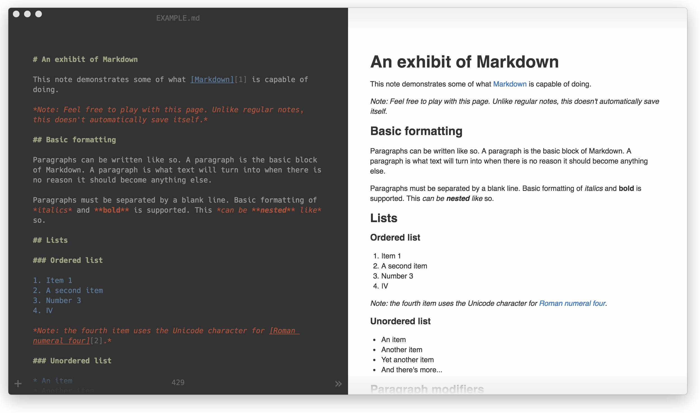

# Ampersand

__Note: Ampersand is WIP and not close to something usable at the moment.__

Ampersand is a _lightweight_ [markdown](https://daringfireball.net/projects/markdown/) editor for Windows, Mac & Linux focused on a minimal & clean interface for distraction-free writing.

## Credits

This application uses code from several open source projects:

* [Electron](http://electron.atom.io/)
* [CodeMirror](http://codemirror.net/)
* [Markdown-JS](https://github.com/evilstreak/markdown-js)
    