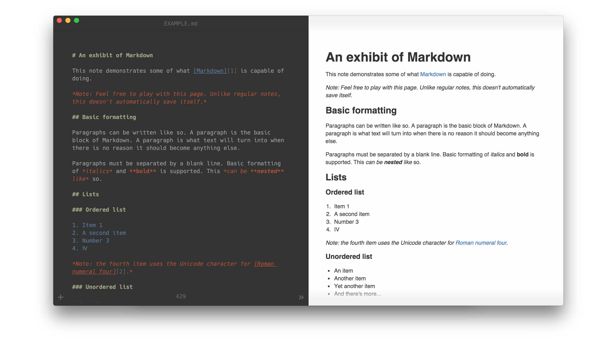

<h1 align="center">
<a href="https://github.com/jackd248/electron-ampersand">
</a><br/><br/>
Ampersand
<br/>
<br/>
</h1>
<hr/>

<h4 align="center">A markdown editor.</h4>

<p align="center">
  <a href="https://github.com/jackd248/electron-ampersand/releases"></a>
  <a href="https://github.com/jackd248/electron-ampersand/releases"></a>
  <a href="https://david-dm.org/jackd248/electron-ampersand"></a>
  <a href="https://david-dm.org/vesparny/jackd248/electron-ampersand#info=devDependencies"></a>
</p>

__Note: Ampersand is WIP and not close to something usable at the moment.__

Ampersand is a _lightweight_ [markdown](https://daringfireball.net/projects/markdown/) editor for Windows, Mac & Linux focused on a minimal & clean interface for distraction-free writing.



## Features

* Live Preview
* Github Flavored Markdown
* Dark/Light/Split Mode
* Full screen mode
* Emoji support
* Export as html

## Build

1. Clone repo ```git clone https://github.com/jackd248/electron-ampersand.git```
2. Change to repo ```cd electron-ampersand```
3. ```npm install && npm start```

## Download

You can [download](https://github.com/jackd248/electron-ampersand/releases) the latest stable version of Ampersand for Windows, Mac OS and Linux. 

## Credits

This application uses code from several open source projects:

* [Electron](http://electron.atom.io/)
* [CodeMirror](http://codemirror.net/)
* [Markdown-It](https://github.com/markdown-it/markdown-it)
* [Hack Typeface](https://github.com/chrissimpkins/Hack)

## License

Copyright (c) 2016 Konrad Michalik, This software is licensed under the [MIT License](LICENSE).